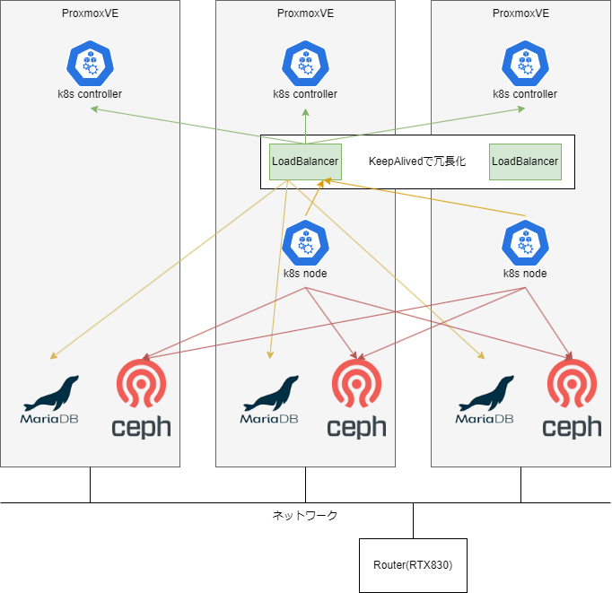

## TL;DR
様々な実験を目的としたプライベートクラウドプラットフォームの開発

## 課題・背景
- アプリケーションのデプロイ・検証などのために、自由に使用できる計算資源が必要だった。
- 今のk8s環境の前に使用していた、ESXiではいくつかのVM上で直接アプリケーションをデプロイしていたが、継続的デプロイの容易性・セルフヒーリング・アプリケーションごとの実行環境の分離性に課題があったため、新環境ではこれらの点を改善したかった。
- クラウド基盤の開発・運用に興味があった。

## 要件
上記の課題を達成するため、以下に要件を定義する。  
- 継続的かつ簡単にアプリケーションをデプロイできる。
- アプリケーションごとに実行環境が分離されていて、ミドルウェアのアップデートなどを個別に行える。
- 特定のノードが停止してもサービス提供を継続できる。

## 設計
上記の要件・目的より、以下のような設計とした。  

## 以下に利用した各ツールの選定理由を示す。  

### Kubernetesの利用
- アプリケーション実行環境の分離
- 継続的かつ簡単にアプリケーションをデプロイできる
- セルフヒーリングが可能

### k0sctlの使用
マニフェストにバージョンや構成などを定義することで、1コマンドでマルチノードクラスターを構築できるため。  

### Cephの利用
- k8s単体では永続データを保持するシステムが存在しないため、Cephをバックエンドとした。
- ErasureCodingを利用することで、特定のノードが停止してもデータにアクセスすることができ、また、効率的にデータを保存することができる。
- Kubernetes向けcsiを利用できるため、PersistentVolumeClaimを使用した場合DynamicProvisioningを使用できる。

### ArgoCDの使用
- GitHub上でマニフェストなどを更新すると、k8s上のリソースを自動で更新する。
- これにより、k8s単体で使用するよりも継続的デプロイを容易にできる。

### Metallb・NginxIngressControllerの使用
外部からアクセスする場合、k8s単体では各アプリケーションに実用的な通信を振り分ける手法を持たない。そこで、MetallbやNginxIngressControllerを利用することで、外部から各アプリケーションへ通信を割り振るようにした。  

### CertManagerの使用
NginxIngressControllerや一部のアプリケーションでは、Let'sEncryptなどので発行できる証明書を利用したかった。そこで、Let'sEncryptの証明書をKubernetes上で発行・管理できるツールであるCertManagerを利用した。  

### Grafana・Prometheus・Loki(開発中)
Kubernetes単体では、リソースの使用状況やログなどをわかりやすく可視化する方法を持たない。そこで、Grafanaを使用してGUIで可視化できるようにした。また、Prometheusを利用してリソース使用状況などを監視し、Lokiを利用して各コンテナのログを監視した。なお、特定のパターンが発生したときに通知する方法や、重要なメトリクスを常時表示するダッシュボードなどは今後開発予定である。  

### HelmFileの使用
上記のように様々なOSSを使用してプライベートクラウド基盤を開発・運用すると、マニフェストの管理やアップデート時の変更・確認などが大変になる。そこで、HelmChartを使用することで、バージョンやHelmリポジトリなどを宣言的に管理しつつ、デフォルトの設定からの変更点のみをyamlに記述することで、マニフェストの管理やアップデート時の変更・確認などを簡略化した。  

### Renovateに使用
　HelmFile定義されたリソースに更新があるときに通知&プルリクエストの生成が行われることで、大量に利用しているOSSの更新を容易に行うことができる。  
　また、RenovateがPullRequestを生成したときに、ActionsによりHelmTemplateを生成し、問題がなければArgoCDがk8sに取り込む構成にすることで、OSSの更新・管理を容易に行うことができる。  

## 障害対応
このような構成で基盤を作成して、様々なアプリケーション(Nextcloud等)を運用したりしながら、一定期間運用を行った。  
一定期間運用を行うことで、何度か障害が発生した。この障害の考えられる原因及び対応の記録を書く。  

### 2023年8月 ノード障害に伴う一部のクラスター障害
#### 事象
　自宅のブレーカーが落ちた際に、1ノードに電源を供給しているUPSが正常に動作しなかった。この際、通常であれば短時間で正常なノードで停止したPodが自動で立ち上がることで障害の影響を軽減するが、csiに問題がありPersistentVolumeを使用していたPodが立ち上がらなかった。これが原因で2時間程度一部のサービスが停止する障害が発生した。  
#### 応急復旧
　csiのバージョンを1つ下げた。  
#### 原因
1、自宅のブレーカが落ちた。  
2、UPSのバッテリーが劣化しており、正常に動作しなかった。  
3、(仮説)csiのアップデート時に特に問題なくアップデートできた。しかし、実際は一部設定ファイルのフォーマットがアップデートにより変わっており、新規にPodを立ち上げることができなくなっていた。このような問題はテスト時に気づき修正する必要があるが、テスト時にPodを起動するテストを行わなかったため気づくことができなかった。  
#### 対応
- UPSを新しいものに変更した。
- (未対応)UPSの動作状況を監視し、バッテリーが劣化した際などは管理者に通知することで、直ちに交換する。
- CSIのアップグレード時などは、テスト環境でPodの起動テストなどを行う。

### 2023年10月　ノード障害に伴う操作ミスによるクラスター障害
#### 事象
　ノードのSSDに異常が生じノード障害が発生した。その際k8sやcephのセルフヒーリングにより数分でサービスは復旧した。故障したノードログを調査したところ、SSDのファームウェアが古いことが原因である可能性が高いことが分かった。ファームウェア更新のため対象ノードの電源を落とそうとしたところ、サーバーにつけていたタグに誤りがあり、間違って正常に動作しているノードを停止させてしまった。その際k8s・cephを含むすべてのサービスが30分程度停止してしまった。(DBサーバに関しては、2時間程度)  
#### 応急復旧
　全てのサーバを起動した。  
#### 応急復旧時のトラブル
　MariaDB Galera Clusterが起動する際、正常に動作しているノードがどれかわからなくなってしまい起動しなかったため、最後に起動していたノード(強制終了させたノード)を最後に起動していたものとしてマークしてクラスターを復旧した。  
#### 対応
　サーバについているタグを正しいものに変更した。  
　そのほかの対応については検討中  
